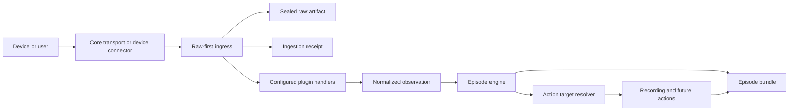

# Architecture

Episode is a local-first incident capture system. Core transports receive and
preserve opaque deliveries; configured plugins can interpret them into a small
vendor-neutral domain. Neither layer decides how incidents are correlated or
which actions run.

## Processing flow



Raw bytes and their receipt are committed before a handler receives an
immutable ingress envelope. That envelope includes the receipt and artifact
identities, bounded payload bytes, byte length, SHA-256, seal state, and
transport metadata. A malformed, unknown, ignored, or failed delivery therefore
still has a durable receipt and artifact record.

Handler selection is explicit. Installed files do not activate plugins, handler
execution has a timeout, failures are isolated, and conflicting claims are
rejected instead of being resolved by registration order.

## Domain language

| Concept | Responsibility | Mutability |
| --- | --- | --- |
| Area | Physical coverage and correlation boundary | Configuration evolves |
| Device | Camera, doorbell, alarm panel, or other physical source | Discovery metadata evolves |
| Raw Artifact | Exact bytes received or generated | Content is sealed and checksummed |
| Ingestion Receipt | One delivery through one connector | Associations may be added |
| Event | Canonical observation deduplicated across receipts | Core observation is stable |
| Evidence | Snapshot, recording, or other incident material | Original bytes are stable |
| Episode | Correlated interpretation of related activity | Evolves until closed |
| Annotation | Derived interpretation from a processing run | Append-only; planned |
| Action Run | One policy-triggered operation and its result | Append-only; planned |

An Event is not a connector message. ONVIF, ISAPI, and Alarm Server can each
create a receipt for the same camera observation while sharing one canonical
Event. Complementary observations, such as broad ONVIF motion followed by a
vendor human classification, remain distinct Events in the same Episode. ONVIF
is the primary standards-based path; vendor connectors add detail.

State transitions also have lifecycle meaning: active observations may open or
extend an Episode, while inactive observations can describe its ongoing state
without extending the inactivity window. This policy belongs to correlation,
not to protocol connectors.

## Current module boundaries

```text
src/episode/
├── connectors/       shared transports and current device connectors
├── ingestion/        raw-first preservation and bounded plugin dispatch
├── plugins/          lazy integrations and vendor interpretation
├── media/            camera media registry and timelapse service
├── actions/          vendor-neutral snapshot action
├── domain/           vendor-neutral models and identities
├── engine/           correlation and lifecycle orchestration
├── recording/        vendor-neutral recording action
├── storage/          SQLite, immutable files, provenance, bundle projection
├── api/              public HTTP representation
└── ui/               static Episode-first web interface
```

Dependencies point inward: transports, plugins, storage, actions, API, and UI
may depend on domain concepts. The domain must not depend on Hikvision, FastAPI,
SQLite, or FFmpeg. Shared transports must not import vendor parsers.

The first shared-ingress implementation is Alarm Server: the core HTTP
transport preserves the complete request body, while the configured Hikvision
handler extracts `EventNotificationAlert`, resolves its device identity, and
emits a normalized observation. HCNetSDK callbacks follow the same raw-first
route; native decoding remains isolated in the SDK plugin.

## Persistence model

SQLite is the operational index. It makes filtering and correlation efficient,
but it is not the only way to understand an incident.

The additive tables are:

- `raw_artifacts`: location, media type, byte length, SHA-256, and seal state.
- `ingestion_receipts`: source, timing, parse status, and links to artifacts,
  Events, Evidence, and Episodes.
- `events`: canonical observations with a stable deduplication key.
- `evidence`: incident material with artifact and integrity references.
- `episodes`: lifecycle and summary index.

Existing databases are migrated in place by adding columns and tables. Raw
artifacts already present on disk are backfilled without rewriting their bytes.

## Episode bundles

Every correlated incident is portable as a directory:

```text
data/episodes/<episode-id>/
├── manifest.json
├── journal.ndjson
├── events/
├── snapshots/
├── recordings/
├── other/
└── timelapses/
```

`manifest.json` is an atomic, rebuildable index containing the Episode, safe
area and device identity, canonical Events, receipts, Evidence, relative file
paths, byte lengths, and SHA-256 checksums.

`journal.ndjson` is append-only history for important bundle changes. A copied
Episode directory therefore retains its relationships even when `episode.db` is
unavailable.

The manifest and journal are derived metadata. They may evolve; original
artifact bytes are never annotated or rendered with overlays.

Recordings remain active for the Episode lifecycle and are stored as sequential,
immutable segments. A shared `recording_session_id` and ordered `segment_index`
identify chunks from one continuous recording action without relying on filename
interpretation.

## Canonical event identity

The first implementation derives a key from:

```text
device id + observed timestamp + normalized event type + event state
```

This intentionally handles duplicate ISAPI and Alarm Server deliveries from the
same configured device. Future connectors may provide a stronger vendor event
identifier through receipt metadata without changing the Event API.

## Integrity and immutability

- Incoming SOAP/XML and completed evidence are SHA-256 hashed.
- Write permissions are removed when the filesystem supports it.
- File moves are collision-safe and never intentionally overwrite evidence.
- Public APIs expose checksums and provenance, not internal absolute paths.
- Overlays and future AI output belong in annotations or derived artifacts.

This is tamper-evident local storage, not a cryptographic chain of custody.
Signed manifests and external timestamping are possible future extensions.

## Extension rules

New shared transports should submit opaque deliveries to `IngestionService`.
Vendor or protocol plugins register narrow matchers and return a normalized
observation only after the durable boundary. Per-device connectors that have
not migrated yet must still preserve Raw Artifacts and Ingestion Receipts before
publishing an Event or Evidence compatibility message.

New actions should consume canonical domain messages or target-resolution
decisions. They must not subscribe directly to vendor-specific connector
payloads. Recording targets are currently resolved from the Event source and
Area; this boundary can accept future target strategies without changing
connectors or recording execution.

New AI, OCR, LPR, or recognition integrations should create versioned processing
runs and append annotations. Reprocessing must never replace prior results or
modify source evidence.

## Known alpha constraints

- Correlation is restricted to time-proximate Events within the same Area.
- `on_event` video devices record their own active Events; `on_episode` video
  devices record active Episodes in their Area, including Episodes opened by
  non-video sources.
- Recording lifetime follows Episode lifetime; ONVIF snapshot capture is
  explicit and disabled by default.
- Broader event-to-action policy is not implemented.
- Authentication and safe Internet exposure are not implemented.
- Annotation and processing-run persistence are planned, not yet public APIs.

These are the next boundaries to extract; they are not reasons to expand
connector-specific logic into the core.
