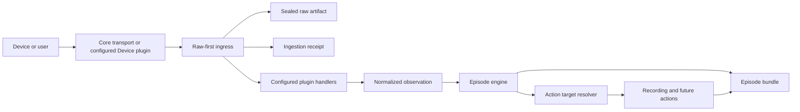

# Architecture

Episode is a local-first incident capture system. Core transports receive and
preserve opaque deliveries; configured plugins can interpret them into a small
vendor-neutral domain. Neither layer decides how incidents are correlated or
which actions run.

## Processing flow



Raw bytes and their receipt are committed before a handler receives an
immutable ingress envelope. That envelope includes the receipt and artifact
identities, bounded payload bytes, byte length, SHA-256, seal state, and
transport metadata. A malformed, unknown, ignored, or failed delivery therefore
still has a durable receipt and artifact record.

Handler selection is explicit. Installed files do not activate plugins, handler
execution has a timeout, failures are isolated, and conflicting claims are
rejected instead of being resolved by registration order.

## Domain language

| Concept | Responsibility | Mutability |
| --- | --- | --- |
| Area | Physical coverage and correlation boundary | Configuration evolves |
| Device | Physical source role: camera, doorbell, alarm panel, sensor, or other | Discovery metadata evolves |
| Raw Artifact | Exact bytes received or generated | Content is sealed and checksummed |
| Ingestion Receipt | One delivery through one connector | Associations may be added |
| Event | Canonical observation deduplicated across receipts | Core observation is stable |
| Evidence | Snapshot, recording, or other incident material | Original bytes are stable |
| Episode | Correlated interpretation of related activity | Evolves until closed |
| Annotation | Derived interpretation from a processing run | Append-only; planned |
| Action Run | One policy-triggered operation and its result | Append-only; planned |

An Event is not a connector message. ONVIF, ISAPI, and Alarm Server can each
create a receipt for the same camera observation while sharing one canonical
Event. Complementary observations, such as broad ONVIF motion followed by a
vendor human classification, remain distinct Events in the same Episode. ONVIF
is the primary standards-based path; vendor connectors add detail.

State transitions also have lifecycle meaning: active observations may open or
extend an Episode, while inactive observations can describe its ongoing state
without extending the inactivity window. This policy belongs to correlation,
not to protocol connectors.

## Current module boundaries

```text
src/episode/
├── connectors/       shared ingress transports
├── ingestion/        raw-first preservation and bounded plugin dispatch
├── plugins/          lazy integrations and protocol/vendor interpretation
│   ├── onvif/        standards-based Device integration
│   └── hikvision/    import-empty vendor namespace and shared XML helpers
│       ├── alarm_server/
│       ├── ftp/
│       ├── isapi/
│       └── sdk/
├── media/            camera media registry and timelapse service
├── actions/          vendor-neutral snapshot action
├── domain/           vendor-neutral models and identities
├── engine/           correlation and lifecycle orchestration
├── recording/        vendor-neutral recording action
├── storage/          SQLite, immutable files, provenance, bundle projection
├── api/              public HTTP representation
└── ui/               static Episode-first web interface
```

Dependencies point inward: transports, plugins, storage, actions, API, and UI
may depend on domain concepts. The domain must not depend on Hikvision, FastAPI,
SQLite, or FFmpeg. Shared transports must not import vendor parsers.

The shared-ingress implementations now cover two transport shapes. The core
HTTP transport preserves the complete Alarm Server request body, while the
configured Hikvision handler extracts `EventNotificationAlert` and emits a
normalized observation. The core FTP transport preserves each uploaded file;
the Hikvision FTP handler recognizes supported filenames and emits snapshot
Evidence. Unknown files remain visible raw deliveries. HCNetSDK callbacks
follow the same raw-first route; native decoding remains isolated in the SDK
plugin.

ISAPI stream ownership, Digest authentication, reconnect behavior, bounded
stream decoding, ignored-Event policy, and XML interpretation live in its lazily
activated Device plugin. ONVIF discovery, media registration, validation,
snapshot endpoints, pull-point subscriptions, and notification interpretation
follow the same lifecycle. Complete SOAP pull responses are preserved before
derived notifications are interpreted. The application core sees only generic
plugin services, raw deliveries, media registrations, inventory updates, and
normalized observations.

## Persistence model

SQLite is the operational index. It makes filtering and correlation efficient,
but it is not the only way to understand an incident.

Area and Device inventory is persistent configuration stored in SQLite.
`episode.json` remains responsible for system-wide services and action
defaults. On an existing installation, legacy `areas` and `devices` arrays are
imported once; subsequent restarts never overwrite UI-managed inventory.
Disabling inventory preserves historical relationships, and referenced records
cannot be deleted. Device type expresses physical role, never vendor. Vendor
identity is discovered when possible, while optional vendor integrations remain
separate capabilities and configurations.

The additive tables include:

- `areas` and `devices`: authoritative inventory, capability configuration,
  credentials, and active state.
- `app_settings`: schema-independent application markers such as one-time
  inventory bootstrap state.
- `raw_artifacts`: location, media type, byte length, SHA-256, and seal state.
- `ingestion_receipts`: source, timing, parse status, and links to artifacts,
  Events, Evidence, and Episodes.
- `events`: canonical observations with a stable deduplication key.
- `evidence`: incident material with artifact and integrity references.
- `episodes`: lifecycle and summary index.

Existing databases are migrated in place by adding columns and tables. Raw
artifacts already present on disk are backfilled without rewriting their bytes.

## Episode bundles

Every correlated incident is portable as a directory:

```text
data/episodes/<episode-id>/
├── manifest.json
├── journal.ndjson
├── events/
├── snapshots/
├── recordings/
├── other/
└── timelapses/
```

`manifest.json` is an atomic, rebuildable index containing the Episode, safe
area and device identity, canonical Events, receipts, Evidence, relative file
paths, byte lengths, and SHA-256 checksums.

`journal.ndjson` is append-only history for important bundle changes. A copied
Episode directory therefore retains its relationships even when `episode.db` is
unavailable.

The manifest and journal are derived metadata. They may evolve; original
artifact bytes are never annotated or rendered with overlays.

The Episode review timeline is also a derived projection. Vendor bounding boxes
remain Event metadata and are rendered as a separate overlay. For review only,
consecutive target snapshots can extend a short-lived detection track and later
annotated Events can update its region. A gap or explicit inactive Event closes
the track. This inference is not written back to Events, Evidence, manifests, or
raw artifacts.

Recordings remain active for the Episode lifecycle and are stored as sequential,
immutable segments. A shared `recording_session_id` and ordered `segment_index`
identify chunks from one continuous recording action without relying on filename
interpretation.

## Canonical event identity

The first implementation derives a key from:

```text
device id + observed timestamp + normalized event type + event state
```

This intentionally handles duplicate ISAPI and Alarm Server deliveries from the
same configured device. Future connectors may provide a stronger vendor event
identifier through receipt metadata without changing the Event API.

## Integrity and immutability

- Incoming SOAP/XML and completed evidence are SHA-256 hashed.
- Write permissions are removed when the filesystem supports it.
- File moves are collision-safe and never intentionally overwrite evidence.
- Public APIs expose checksums and provenance, not internal absolute paths.
- Overlays and future AI output belong in annotations or derived artifacts.

This is tamper-evident local storage, not a cryptographic chain of custody.
Signed manifests and external timestamping are possible future extensions.

## Extension rules

New shared transports should submit opaque deliveries to `IngestionService`.
Device and ingress-handler plugins register narrow matchers and return a
normalized observation only after the durable boundary. Device integrations own
their protocol clients, discovery, connection supervision, validation, and
interpretation; the application must not construct protocol-specific
connectors.

New actions should consume canonical domain messages or target-resolution
decisions. They must not subscribe directly to vendor-specific connector
payloads. Recording targets are currently resolved from the Event source and
Area; this boundary can accept future target strategies without changing
connectors or recording execution.

New AI, OCR, LPR, or recognition integrations should create versioned processing
runs and append annotations. Reprocessing must never replace prior results or
modify source evidence.

## Operational API projection

The API owns the stable operational representation consumed by the UI. It
projects internal connector and plugin state into vendor-neutral Services,
Integrations, Device identity, Device capabilities, and capture policy.
Connector dictionaries and plugin lifecycle objects are diagnostics inputs;
they are not UI contracts.

`/health` remains a minimal liveness response. `/api/v1/status` is the compact,
frequently-polled summary and deliberately excludes connector discovery data.
`/api/v1/diagnostics` provides richer normalized detail for the System view.
Device collection responses are compact; Device detail adds safe network,
policy, media-profile, and integration information without exposing credentials
or internal configuration structures.

Growing top-level collections have validated limits and offsets. Area and
Device mutation routes enforce referential safety, duplicate-address checks,
write-only credentials, and active-Area constraints. Integration support,
configured selection, and runtime health are separate states: safe validation
probes provide evidence without activating connectors, and transient failures
are never presented as proof of unsupported hardware. Device changes are durable
immediately but set a visible restart-required state because connector lifecycle
reconfiguration is intentionally deferred to process startup in alpha.6.

## Known alpha constraints

- Correlation is restricted to time-proximate Events within the same Area.
- `on_event` video devices record their own active Events; `on_episode` video
  devices record active Episodes in their Area, including Episodes opened by
  non-video sources.
- Recording lifetime follows Episode lifetime; ONVIF snapshot capture is
  explicit and disabled by default.
- Broader event-to-action policy is not implemented.
- Authentication and safe Internet exposure are not implemented.
- Annotation and processing-run persistence are planned, not yet public APIs.

These are the next boundaries to extract; they are not reasons to expand
connector-specific logic into the core.
